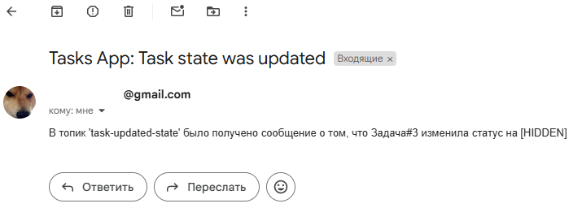

# Инфо

Проект для обучения.

### БД + Kafka

```bash
docker compose up
```

# Задача 1. Tasks CRUD + AOP

Небольшое приложение, реализующее RESTful сервис с логированием через аспекты.

### Чеклист

- Task (id, title, description, userId)
- GET /tasks/{id}
- GET /tasks
- POST /tasks
- PUT /tasks/{id}
- DELETE /tasks/{id}
- Аспект TaskAspect для логирования
  - `@Around` для замера времени выполнения
  - `@Before` для ограничения выполнения метода для открытого API
  - `@AfterReturning` для стилизации разных типов задач в логе
  - `@AfterThrowing` для дополнительной информации об ошибке

# Задача 2. Kafka

Конфигурация Кафки в приложении. Отправка сообщений об изменении статуса задач на почту.

### Чеклист

- KafkaConfig: Consumer, Producer, DLQ, DLQ Producer
- MailConfig: подключение к почтовому сервису
- TaskUpdState Producer: отправка сообщение при изменении 'state' у Task через PUT update().
- TaskUpdState Consumer: получение сообщения, отправка email (via NotificationService).
- NotificationService: функционал для форматирования и отправки сообщения на указанный почтовый адрес.

### Результат
  
